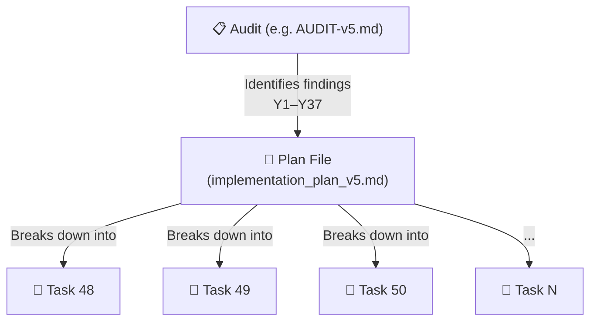

# How to Add New Plans and Task Files — CBEA Website

Based on the existing conventions established across 4 plan files and 39 task files (Tasks 09–47), here's the exact workflow and formatting guide for adding new ones based on AUDIT-v5.

---

## The Relationship: Plans vs Tasks



- **Plan file** = the *whole picture*. It maps an audit's findings to prioritized fix groups (P0 → P1 → P2 → P3) and lists each task with a summary, files touched, and the audit finding(s) it addresses.
- **Task files** = *individual units of work* within a plan. Each is a standalone, self-contained instruction document that an implementer (human or AI) can pick up and execute without needing to read the full plan.

---

## Step 1 — Create the Plan File

### Location & Naming

| Item | Convention |
|---|---|
| **Directory** | `plans/` |
| **Filename** | `implementation_plan_v{N}.md` where `{N}` is the session number |
| **Next file** | [implementation_plan_v5.md](file:///c:/Users/Admin/Documents/CBEA_Website/plans/implementation_plan_v5.md) (since v4 exists) |

### Plan File Template

```markdown
# CBEA Budget Transparency Portal — Audit Remediation Plan v{N} (Session {N+1})

Remediate all findings from the [strict code audit v{N}](file:///path/to/AUDIT-v{N}.md) 
dated YYYY-MM-DD. ... brief summary of current state, target grade ...

## User Review Required

> [!CAUTION]
> **Most critical finding** — describe the deploy blocker and its impact.

> [!IMPORTANT]
> **Design decisions** — any choices the user needs to make.

> [!WARNING]
> **Numbered task continuation.** Session N-1 tasks were `XX`–`YY`. This plan 
> continues with `ZZ`–`WW` to preserve traceability across sessions.

## Open Questions

1. **Question 1** — options? (Recommended: ...)
2. **Question 2** — options? (Recommended: ...)

---

## Proposed Changes

### P0 — Block Deploy (fix BEFORE next production deploy)

#### Task {next_number} — {Title}

{One-paragraph description of what the task does and why it matters.}

**Files:**
- [MODIFY] [filename](file:///absolute/path/to/file) — brief note
- [NEW] [filename](file:///absolute/path/to/file) — brief note
- [DELETE] [filename](file:///absolute/path/to/file) — brief note

**Audit findings addressed:** Y{N} (SEVERITY, -X pts)

---

### P1 — High (fix within 30 days of production launch)

#### Task {next_number} — {Title}
... same structure as P0 tasks ...

---

### P2 — Medium (fix in v1.1+)

#### Task {next_number} — {Title}
... same structure ...

---

### P3 — Low / Tech Debt (fix in v1.2+, polish)

| ID | Finding | File:Line | Fix | Effort |
|---|---|---|---|---|
| P3-1 | Y{N} — title | `file:line` | Brief fix description | S/XS |
... (P3 items can use a table for brevity) ...

---

### Monitor Only (no code change)

#### {ID} — {Title} (carryover)
... description ...

---

## Verification Plan

### Automated Tests
```bash
npx tsc --noEmit
npx eslint
npx vitest run
npm run build
```

### Security Verification
```bash
grep -rn '...' app/ lib/ ...
```

### Manual Verification
- ...

---

## Grade Projection

| Fix Group | Points Gained | Running Total |
|---|---|---|
| Baseline | — | {current}/100 |
| + P0 | +X | ... |
| + P1 | +X | ... |
| + P2 | +X | ... |
| + P3 | +X | ... |

---

## Suggested Implementation Order

**Sprint 1:** ...
**Sprint 2:** ...

---

## Cross-reference

| Document | Purpose |
|---|---|
| [AUDIT-v5.md](...) | Source audit |
| [implementation_plan_v4.md](...) | Previous plan |
| ... | ... |
```

### Key Conventions from Existing Plans

1. **Task numbering is continuous across all plans** — v1 had 01–08, v2 had 09–16, v3 had 17–24, v4 had 25–30 *(note: AUDIT-v4's plan used 31–47)*. **The next plan (v5) should start at Task 48.**
2. **Priority tiers** follow `P0 > P1 > P2 > P3` — same as the audit's fix plan sections (§9, §10, §11, §12).
3. **File references** use `[MODIFY]`, `[NEW]`, `[DELETE]` prefixes with clickable `file:///` links.
4. **Each task in the plan** references the audit finding IDs it resolves (e.g., `Y1 (HIGH, -3 pts)`).
5. **Grade projection table** shows cumulative score recovery as each tier is applied.

---

## Step 2 — Create Individual Task Files

### Location & Naming

| Item | Convention |
|---|---|
| **Directory** | `tasks/` |
| **Filename** | `{NN}_{snake_case_title}.md` where `{NN}` is the zero-padded task number |
| **Examples** | `48_add_role_authorization_check.md`, `49_move_test_credentials.md` |

### Task File Template

```markdown
# Task {NN}: {Human-Readable Title}

## Objective
{One paragraph explaining WHAT this task does, WHY it matters, and the DOMAIN 
CONTEXT that makes this fix important. Reference the specific code behavior being 
fixed and the risk if left unfixed.}

## Audit Reference
- **Findings:** Y{N} (SEVERITY, -X pts)
- **Severity:** HIGH/MEDIUM/LOW ({one-line justification})
- **Current grade impact:** +X points.
- **Source:** AUDIT-v5 §{section} finding Y{N}, §{section} step-by-step instructions.

## Files Created / Modified
- [MODIFY] [filename](file:///absolute/path/to/file) — brief description of changes
- [NEW] [filename](file:///absolute/path/to/file) — what this new file does
- [DELETE] [filename](file:///absolute/path/to/file) — why it's being removed

## Step-by-Step Instructions

### 1. {First step title}

{Prose description of what to change.}

```{language}
/* BEFORE (file:line): */
{exact code being replaced}

/* AFTER: */
{exact replacement code}
```

### 2. {Second step title}
... repeat pattern ...

### 3. Verify

```bash
{verification commands}
```

## Metro Design Compliance & Best Coding Practices
- {Any design-system implications}
- {Any coding conventions being followed}

## Automated Testing & Verification Plan

### Automated Tests
```bash
{test commands to run}
```

### Manual Verification
- {Manual steps to confirm the fix works}

## Acceptance Criteria
- [ ] {Criterion 1 — verifiable statement}
- [ ] {Criterion 2 — verifiable statement}
- [ ] {Criterion 3 — verifiable statement}
- [ ] {Final quality gate: `npx tsc --noEmit`, `npx vitest run`, `npm run build` all pass}
```

### Key Conventions from Existing Task Files

1. **Acceptance criteria use checkboxes** (`- [ ]` for pending, `- [x]` for completed). These serve as the "done" signal — a task is complete when all criteria are checked.
2. **Before/After code diffs** are mandatory for code-change tasks. Show the exact line(s) being changed.
3. **Verification commands** appear both inline (after each step) and in the dedicated "Automated Testing" section.
4. **Metro Design Compliance** section is always present, even if just to say "no design-system impact."
5. **Task files are self-contained** — an implementer should be able to execute the task from the task file alone, without needing to re-read the plan or audit.

---

## Step 3 — Mapping AUDIT-v5 to Plan v5 and Tasks 48+

Based on AUDIT-v5's fix plan (§9–§12), here's how the findings would map:

### Suggested Task Numbering for v5

| Task # | Priority | Audit Finding(s) | Title |
|---|---|---|---|
| **48** | P0 | Y1 | Add role/authorization check to admin pages |
| **49** | P0 | Y7 | Move hardcoded test credentials to env vars |
| **50** | P0 | (operational) | Disable public Supabase Auth signups |
| **51** | P1 | Y2 | Fix EntryForm type-safety lie |
| **52** | P1 | Y3 | Fix revalidatePath no-op in server actions |
| **53** | P1 | Y11 | Add pagination to getEntries |
| **54** | P1 | Y10 | Replace getSummaryStats JS loop with SQL aggregate |
| **55** | P1 | Y4 | Gate console.error behind NODE_ENV or structured logger |
| **56** | P1 | Y5 | Add co-located tests for 5 route pages |
| **57** | P1 | Y6 | Real layout.test.tsx coverage |
| **58** | P1 | Y17, Y18 | Add role="alert" to error divs |
| **59** | P2 | Y8 | Replace `as BudgetEntry` casts with Zod parse |
| **60** | P2 | Y9 | Hydration fix for new Date() in EntryForm |
| **61** | P2 | Y14 | Parallelize profile fetch in admin page |
| **62** | P2 | Y16 | Focus management in delete-confirmation |
| **63** | P2 | Y19 | role="radiogroup" for type toggle |
| **64** | P2 | Y23 | AdminSemesterSelector startTransition |
| **65** | P2 | Y27 | Escape ILIKE wildcards in search |
| **66** | P2 | Y28 | Fix/delete scratch/test-crud.test.ts |
| **67** | P2 | Y29 | Fix supabase.test.ts stale mock call shape |
| **68** | P2 | Y30 | Fix global-setup.ts TOCTOU |
| **69** | P2 | Y15 | Use MAX(date) for asOfDate |
| **70** | P2 | Y25 | Add keyboard-nav test for PivotTabs |
| **71+** | P3 | Y12,Y13,Y20–Y22,Y24,Y26,Y31–Y37 | Various cosmetic/tech debt fixes |

> [!TIP]
> Task 50 (P0-3) is an **operational task** (Supabase Dashboard action, not code). You can still create a task file for it with documentation/verification steps, following the pattern established in AUDIT-v5 §9 P0-3.

---

## Checklist: Adding a New Plan + Tasks

- [ ] Read the source audit thoroughly (every finding, every fix suggestion)
- [ ] Create `plans/implementation_plan_v{N}.md` following the plan template
- [ ] Number tasks **continuously** from the last task (currently 47 → start at 48)
- [ ] Group tasks by priority tier (P0 → P1 → P2 → P3)
- [ ] For each task in the plan, create `tasks/{NN}_{snake_case_title}.md`
- [ ] Each task file includes: Objective, Audit Reference, Files, Step-by-Step, Before/After diffs, Metro Compliance, Testing, Acceptance Criteria
- [ ] Cross-reference table at the bottom of the plan links to all prior audits and plans
- [ ] Grade projection table shows cumulative score recovery
- [ ] Suggested implementation order with sprint groupings
