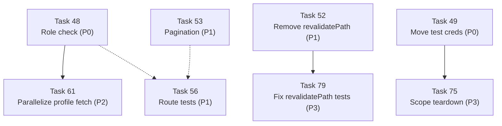

# CBEA Budget Transparency Portal — Audit Remediation Plan v5 (Session 6)

Remediate all findings from the [strict code audit v5](file:///c:/Users/Admin/Documents/CBEA_Website/documentations/AUDIT-v5.md) dated 2026-07-20. The audit scored the project **82/100 (B−)** — all 39 prior tasks (09–47) were correctly applied and verified, but 37 NEW findings (Y1–Y37) were discovered during the fully independent re-grade that prior audits had missed. This plan brings the project from 82/100 (B−) to **target: 98/100 (A+)** through Tasks 48–84.

## User Review Required

> [!CAUTION]
> **Y1 (HIGH, -3 pts) — Block deploy.** `app/admin/page.tsx` only checks *authentication* (Supabase session exists), not *authorization* (the user has a designated officer role in `profiles`). Any Supabase-Authenticated user can reach `/admin` and publish budget entries. Combined with default public-signup, this means anyone on the internet could fabricate financial data on the transparency portal. **Fix Y1 (Task 48) before any production deploy.**

> [!CAUTION]
> **Y7 (MEDIUM, -2 pts) — Block deploy.** `jane.doe@csu.edu.ph` / `Password123!` is committed in plaintext in 4 source files. If the production Supabase project is the same as the test project, anyone with repo access can authenticate as the Treasurer. **Fix Y7 (Task 49) before any production deploy.**

> [!IMPORTANT]
> **P1-5 console.error has two options.** Task 55 fixes the 17 `console.error` calls in production paths. Two approaches:
> - **(a) Gate behind `NODE_ENV`** — simpler, wraps each call in `if (process.env.NODE_ENV !== 'production')`.
> - **(b) Structured logger** — better, creates `lib/log.ts` with JSON-structured logging and field redaction.
>
> Option (b) is recommended for long-term maintainability. Both options eliminate raw error leakage.

> [!WARNING]
> **Numbered task continuation.** Session 1 tasks were `01`–`08`. Session 2 tasks were `09`–`16`. Session 3 tasks were `17`–`24`. Session 4 tasks were `25`–`30`. Session 5 tasks were `31`–`47`. This plan continues with `48`–`84` to preserve traceability across sessions.

## Open Questions

1. **P1-5 console.error approach** — `NODE_ENV` gate (Option A, simpler) vs structured logger (Option B, better)? (Recommended: Option B.)
2. **P1-2 revalidatePath** — Remove no-op calls entirely (Option A) vs migrate to `unstable_cache` + `revalidateTag` (Option B)? (Recommended: Option A for v1 simplicity.)
3. **P3-17 income green** — Document `--color-income` as a permitted semantic color, or switch to Lime for income per strict Metro? (Recommended: document as permitted.)
4. **P3-14 amount zero** — Tighten `CHECK (amount > 0)` or document zero-amount as intentional? (Recommended: tighten.)

---

## Proposed Changes

### P0 — Block Deploy (fix BEFORE next production deploy)

#### Task 48 — Add Role/Authorization Check to Admin Pages

Add a role/authorization check to `getOfficer()` in `lib/auth/session.ts` so it verifies the user has a `profiles` row with an authorized role (Treasurer, Auditor, President, Vice President, Secretary). Update all admin pages to use the enriched `Officer` type. Remove the now-redundant profile fetch in `app/admin/page.tsx`.

**Files:**
- [MODIFY] [lib/auth/session.ts](file:///c:/Users/Admin/Documents/CBEA_Website/lib/auth/session.ts) — add `AUTHORIZED_ROLES`, fetch profile, verify role
- [MODIFY] [app/admin/page.tsx](file:///c:/Users/Admin/Documents/CBEA_Website/app/admin/page.tsx) — remove redundant profile fetch, use enriched Officer
- [MODIFY] [app/admin/new/page.tsx](file:///c:/Users/Admin/Documents/CBEA_Website/app/admin/new/page.tsx) — use enriched Officer
- [MODIFY] [app/admin/edit/[id]/page.tsx](file:///c:/Users/Admin/Documents/CBEA_Website/app/admin/edit/%5Bid%5D/page.tsx) — use enriched Officer

**Audit findings addressed:** Y1 (HIGH, -3 pts)

#### Task 49 — Move Hardcoded Test Credentials to Environment Variables

Move `jane.doe@csu.edu.ph` / `Password123!` from 4 source files into environment variables (`TEST_USER_EMAIL`, `TEST_USER_PASSWORD`) loaded from `.env.local`. Add validation with runtime checks. Update `.env.example` with placeholder values.

**Files:**
- [MODIFY] [tests/global-setup.ts](file:///c:/Users/Admin/Documents/CBEA_Website/tests/global-setup.ts) — replace hardcoded credentials with env vars
- [MODIFY] [tests/auth.setup.ts](file:///c:/Users/Admin/Documents/CBEA_Website/tests/auth.setup.ts) — replace hardcoded credentials with env vars
- [MODIFY] [tests/auth-flow.spec.ts](file:///c:/Users/Admin/Documents/CBEA_Website/tests/auth-flow.spec.ts) — replace hardcoded credentials with env vars
- [MODIFY] [scratch/create-test-user.ts](file:///c:/Users/Admin/Documents/CBEA_Website/scratch/create-test-user.ts) — replace hardcoded credentials with env vars
- [MODIFY] [.env.example](file:///c:/Users/Admin/Documents/CBEA_Website/.env.example) — add TEST_USER_EMAIL, TEST_USER_PASSWORD placeholders

**Audit findings addressed:** Y7 (MEDIUM, -2 pts)

#### Task 50 — Disable Public Supabase Auth Signups

Operationally disable public signups in the Supabase Dashboard. This is a Dashboard action, not a code change, but is documented as a task for traceability and includes a verification script.

**Files:**
- None (Dashboard action)
- [NEW] [scratch/verify-signup-disabled.js](file:///c:/Users/Admin/Documents/CBEA_Website/scratch/verify-signup-disabled.js) — verification script

**Audit findings addressed:** P0-3 (operational defense-in-depth for Y1)

---

### P1 — High (fix within 30 days of production launch)

#### Task 51 — Fix EntryForm Type-Safety Lie

Split the `EntryFormProps.initialData` type from `BudgetEntry` (centavos) to a new `EntryFormInitialData` type (pesos). Update the edit page and tests to reflect the real unit of measurement, preventing a future ₱150→₱15,000 multiplication bug.

**Files:**
- [MODIFY] [app/admin/components/EntryForm.tsx](file:///c:/Users/Admin/Documents/CBEA_Website/app/admin/components/EntryForm.tsx) — new `EntryFormInitialData` type
- [MODIFY] [app/admin/edit/[id]/page.tsx](file:///c:/Users/Admin/Documents/CBEA_Website/app/admin/edit/%5Bid%5D/page.tsx) — use `EntryFormInitialData`
- [MODIFY] [app/admin/components/EntryForm.test.tsx](file:///c:/Users/Admin/Documents/CBEA_Website/app/admin/components/EntryForm.test.tsx) — fix mock data and assertions

**Audit findings addressed:** Y2 (HIGH, -1 pt)

#### Task 52 — Remove No-Op revalidatePath Calls from Server Actions

Remove the 6 no-op `revalidatePath('/')` and `revalidatePath('/admin')` calls from `createEntry`, `updateEntry`, and `deleteEntry`. Both routes are dynamic, making `revalidatePath` a no-op. Add a comment explaining the cache strategy.

**Files:**
- [MODIFY] [app/actions/entries.ts](file:///c:/Users/Admin/Documents/CBEA_Website/app/actions/entries.ts) — remove 6 revalidatePath calls, add explanatory comments
- [MODIFY] [app/actions/entries.test.ts](file:///c:/Users/Admin/Documents/CBEA_Website/app/actions/entries.test.ts) — remove revalidatePath assertions

**Audit findings addressed:** Y3 (MEDIUM, -1 pt)

#### Task 53 — Add Pagination to getEntries

Add `page` and `pageSize` parameters to `getEntries` with Supabase `.range()` and `{ count: 'exact' }`. Update callers and list components to support a "Load more" button. Default 50 entries per page, max 100.

**Files:**
- [MODIFY] [lib/data/entries.ts](file:///c:/Users/Admin/Documents/CBEA_Website/lib/data/entries.ts) — add pagination params and `hasMore` return
- [MODIFY] [app/page.tsx](file:///c:/Users/Admin/Documents/CBEA_Website/app/page.tsx) — handle paginated result, pass `page` from searchParams
- [MODIFY] [app/admin/page.tsx](file:///c:/Users/Admin/Documents/CBEA_Website/app/admin/page.tsx) — handle paginated result
- [MODIFY] [app/components/BudgetEntryList.tsx](file:///c:/Users/Admin/Documents/CBEA_Website/app/components/BudgetEntryList.tsx) — render "Load more" button
- [MODIFY] [app/admin/components/EntryTable.tsx](file:///c:/Users/Admin/Documents/CBEA_Website/app/admin/components/EntryTable.tsx) — render "Load more" button
- [MODIFY] [lib/data/entries.test.ts](file:///c:/Users/Admin/Documents/CBEA_Website/lib/data/entries.test.ts) — update tests for new return shape

**Audit findings addressed:** Y11 (MEDIUM, -1 pt)

#### Task 54 — Replace getSummaryStats JS Loop with SQL Aggregate

Create a Postgres function `get_summary_stats(p_semester text)` that does the aggregation in SQL (one-row return, index-only scan). Update `getSummaryStats` to call `.rpc('get_summary_stats', ...)`. Eliminates the 500-row JS-side loop.

**Files:**
- [MODIFY] [supabase/migration.sql](file:///c:/Users/Admin/Documents/CBEA_Website/supabase/migration.sql) — add `get_summary_stats` function + GRANT
- [MODIFY] [lib/data/entries.ts](file:///c:/Users/Admin/Documents/CBEA_Website/lib/data/entries.ts) — replace JS aggregation with `.rpc()` call
- [MODIFY] [supabase/database.test.ts](file:///c:/Users/Admin/Documents/CBEA_Website/supabase/database.test.ts) — add aggregate function test

**Audit findings addressed:** Y10 (MEDIUM, -1 pt)

#### Task 55 — Replace console.error with Structured Logger

Create `lib/log.ts` with a structured JSON logger that redacts sensitive fields. Replace all 17 `console.error` calls in production paths (`app/actions/entries.ts`, `lib/data/entries.ts`, `app/admin/components/AdminHeader.tsx`) with `logger.error(...)`.

**Files:**
- [NEW] [lib/log.ts](file:///c:/Users/Admin/Documents/CBEA_Website/lib/log.ts) — structured logger
- [MODIFY] [app/actions/entries.ts](file:///c:/Users/Admin/Documents/CBEA_Website/app/actions/entries.ts) — replace 6 console.error
- [MODIFY] [lib/data/entries.ts](file:///c:/Users/Admin/Documents/CBEA_Website/lib/data/entries.ts) — replace 10 console.error
- [MODIFY] [app/admin/components/AdminHeader.tsx](file:///c:/Users/Admin/Documents/CBEA_Website/app/admin/components/AdminHeader.tsx) — replace 1 console.error

**Audit findings addressed:** Y4 (MEDIUM, -1 pt)

#### Task 56 — Add Co-Located Tests for 5 Route Pages

Add `*.test.tsx` files for `app/page.tsx`, `app/login/page.tsx`, `app/admin/page.tsx`, `app/admin/new/page.tsx`, and `app/admin/edit/[id]/page.tsx`. Test auth-redirect logic, searchParams parsing, error banner rendering, and data-fetch failure states.

**Files:**
- [NEW] [app/page.test.tsx](file:///c:/Users/Admin/Documents/CBEA_Website/app/page.test.tsx) — homepage route tests
- [NEW] [app/login/page.test.tsx](file:///c:/Users/Admin/Documents/CBEA_Website/app/login/page.test.tsx) — login route tests
- [NEW] [app/admin/page.test.tsx](file:///c:/Users/Admin/Documents/CBEA_Website/app/admin/page.test.tsx) — admin dashboard route tests
- [NEW] [app/admin/new/page.test.tsx](file:///c:/Users/Admin/Documents/CBEA_Website/app/admin/new/page.test.tsx) — new entry route tests
- [NEW] [app/admin/edit/[id]/page.test.tsx](file:///c:/Users/Admin/Documents/CBEA_Website/app/admin/edit/%5Bid%5D/page.test.tsx) — edit entry route tests

**Audit findings addressed:** Y5 (MEDIUM, -2 pts)

#### Task 57 — Add Real Coverage to layout.test.tsx

Replace the no-op test that renders `<div>Test Child</div>` with real tests that render `<RootLayout>` and assert `lang`, body classes, metadata, and child rendering.

**Files:**
- [MODIFY] [app/layout.test.tsx](file:///c:/Users/Admin/Documents/CBEA_Website/app/layout.test.tsx) — replace no-op test with real RootLayout coverage

**Audit findings addressed:** Y6 (MEDIUM, -1 pt)

#### Task 58 — Add role="alert" to Error Divs

Add `role="alert"` to the error display divs in `app/login/page.tsx`, `app/admin/components/EntryForm.tsx`, and `app/admin/components/EntryTable.tsx` to match the accessible pattern already used by `ErrorBanner.tsx`.

**Files:**
- [MODIFY] [app/login/page.tsx](file:///c:/Users/Admin/Documents/CBEA_Website/app/login/page.tsx) — add `role="alert"` to error div
- [MODIFY] [app/admin/components/EntryForm.tsx](file:///c:/Users/Admin/Documents/CBEA_Website/app/admin/components/EntryForm.tsx) — add `role="alert"` to server error div
- [MODIFY] [app/admin/components/EntryTable.tsx](file:///c:/Users/Admin/Documents/CBEA_Website/app/admin/components/EntryTable.tsx) — add `role="alert"` to server error div

**Audit findings addressed:** Y17 (LOW, -0.5 pts), Y18 (LOW, -0.5 pts)

---

### P2 — Medium (fix in v1.1+)

#### Task 59 — Replace `as BudgetEntry` Casts with Zod Parse

Replace 4 `as BudgetEntry` unchecked type casts in `app/actions/entries.ts` and `app/admin/edit/[id]/page.tsx` with `BudgetEntrySchema.safeParse()` for runtime validation. Create a `BudgetEntryRecordSchema` that includes DB-generated fields (`id`, `entered_by`, `created_at`, `updated_at`).

**Files:**
- [MODIFY] [lib/types.ts](file:///c:/Users/Admin/Documents/CBEA_Website/lib/types.ts) — add `BudgetEntryRecordSchema`
- [MODIFY] [app/actions/entries.ts](file:///c:/Users/Admin/Documents/CBEA_Website/app/actions/entries.ts) — replace 2 `as BudgetEntry` casts
- [MODIFY] [app/admin/edit/[id]/page.tsx](file:///c:/Users/Admin/Documents/CBEA_Website/app/admin/edit/%5Bid%5D/page.tsx) — replace 2 `as BudgetEntry` casts

**Audit findings addressed:** Y8 (MEDIUM, -0.5 pts)

#### Task 60 — Fix Hydration Risk from new Date() in EntryForm

Replace `new Date().toISOString().split('T')[0]` in `useState` initializer with empty string, then set today's date in `useEffect` to avoid SSR/hydration date mismatch at midnight UTC.

**Files:**
- [MODIFY] [app/admin/components/EntryForm.tsx](file:///c:/Users/Admin/Documents/CBEA_Website/app/admin/components/EntryForm.tsx) — move date initialization to useEffect
- [MODIFY] [app/admin/components/EntryForm.test.tsx](file:///c:/Users/Admin/Documents/CBEA_Website/app/admin/components/EntryForm.test.tsx) — update test for empty initial date

**Audit findings addressed:** Y9 (MEDIUM, -0.5 pts)

#### Task 61 — Parallelize Profile Fetch in Admin Page

Move the sequential `profiles` fetch into a `Promise.all` alongside `getSemesters()` so both run in parallel. (Moot after Task 48 if `getOfficer()` already returns profile data — in that case, remove the redundant fetch entirely.)

**Files:**
- [MODIFY] [app/admin/page.tsx](file:///c:/Users/Admin/Documents/CBEA_Website/app/admin/page.tsx) — parallelize or remove redundant profile fetch

**Audit findings addressed:** Y14 (LOW, -0.25 pts)

#### Task 62 — Fix Delete-Confirmation Focus Loss

Add a `useRef` + `useEffect` to `EntryTable` that focuses the Confirm button when `confirmingId` changes, preventing keyboard focus from jumping to `<body>` when the Delete button unmounts.

**Files:**
- [MODIFY] [app/admin/components/EntryTable.tsx](file:///c:/Users/Admin/Documents/CBEA_Website/app/admin/components/EntryTable.tsx) — add focus management
- [MODIFY] [app/admin/components/EntryTable.test.tsx](file:///c:/Users/Admin/Documents/CBEA_Website/app/admin/components/EntryTable.test.tsx) — add focus test

**Audit findings addressed:** Y16 (LOW, -0.5 pts)

#### Task 63 — Add role="radiogroup" to Type Toggle

Wrap the Income/Expense toggle buttons in `<fieldset role="radiogroup">` with `aria-checked` attributes, making the mutually-exclusive choice accessible to screen readers.

**Files:**
- [MODIFY] [app/admin/components/EntryForm.tsx](file:///c:/Users/Admin/Documents/CBEA_Website/app/admin/components/EntryForm.tsx) — wrap toggle in fieldset/radiogroup
- [MODIFY] [app/admin/components/EntryForm.test.tsx](file:///c:/Users/Admin/Documents/CBEA_Website/app/admin/components/EntryForm.test.tsx) — assert aria-checked toggles

**Audit findings addressed:** Y19 (LOW, -0.5 pts)

#### Task 64 — Wrap AdminSemesterSelector router.push in startTransition

Add `useTransition` and wrap `router.push(...)` in `startTransition()` for consistency with `ClientFilters.tsx` and to surface pending state.

**Files:**
- [MODIFY] [app/admin/components/AdminSemesterSelector.tsx](file:///c:/Users/Admin/Documents/CBEA_Website/app/admin/components/AdminSemesterSelector.tsx) — wrap in startTransition

**Audit findings addressed:** Y23 (LOW, -0.25 pts)

#### Task 65 — Escape ILIKE Wildcards in Search Input

Escape `%`, `_`, and `\` characters in user search input before passing to Supabase `.ilike()`, so these characters are treated as literals instead of wildcards.

**Files:**
- [MODIFY] [lib/data/entries.ts](file:///c:/Users/Admin/Documents/CBEA_Website/lib/data/entries.ts) — escape wildcards before ILIKE
- [MODIFY] [lib/data/entries.test.ts](file:///c:/Users/Admin/Documents/CBEA_Website/lib/data/entries.test.ts) — add wildcard-escape test

**Audit findings addressed:** Y27 (LOW, -0.25 pts)

#### Task 66 — Delete Stale scratch/test-crud.test.ts

Delete `scratch/test-crud.test.ts` entirely — it mocks the old `getUser()` API (superseded by `getClaims()` in Task 26) and is superseded by `app/actions/entries.test.ts` (18 proper tests).

**Files:**
- [DELETE] [scratch/test-crud.test.ts](file:///c:/Users/Admin/Documents/CBEA_Website/scratch/test-crud.test.ts) — stale mock, superseded by entries.test.ts

**Audit findings addressed:** Y28 (LOW, -0.25 pts)

#### Task 67 — Fix supabase.test.ts Stale Mock Call Shape

Remove the unnecessary `!` non-null assertion and extra `{}` second argument from `cookiesObj.setAll` call in `lib/supabase/supabase.test.ts:91`.

**Files:**
- [MODIFY] [lib/supabase/supabase.test.ts](file:///c:/Users/Admin/Documents/CBEA_Website/lib/supabase/supabase.test.ts) — fix setAll call shape

**Audit findings addressed:** Y29 (LOW, -0.25 pts)

#### Task 68 — Fix global-setup.ts TOCTOU and Missing Error Handling

Check the `error` return from `getUserById`, distinguish "user not found" from transient errors, and add try/catch around user creation and cleanup.

**Files:**
- [MODIFY] [tests/global-setup.ts](file:///c:/Users/Admin/Documents/CBEA_Website/tests/global-setup.ts) — add error handling, fix TOCTOU

**Audit findings addressed:** Y30 (LOW, -0.25 pts)

#### Task 69 — Use MAX(updated_at) for asOfDate

Add a `getLastUpdatedDate(semester?)` function that returns `MAX(updated_at)` from budget entries. Use it in both `app/page.tsx` and `app/admin/page.tsx` instead of `new Date()`, so the "as of" timestamp reflects the data's actual last-update time.

**Files:**
- [MODIFY] [lib/data/entries.ts](file:///c:/Users/Admin/Documents/CBEA_Website/lib/data/entries.ts) — add `getLastUpdatedDate` function
- [MODIFY] [app/page.tsx](file:///c:/Users/Admin/Documents/CBEA_Website/app/page.tsx) — use `getLastUpdatedDate` for asOfDate
- [MODIFY] [app/admin/page.tsx](file:///c:/Users/Admin/Documents/CBEA_Website/app/admin/page.tsx) — use `getLastUpdatedDate` for asOfDate

**Audit findings addressed:** Y15 (LOW, -0.25 pts)

#### Task 70 — Add Keyboard-Navigation Tests for PivotTabs

Add test cases for ArrowRight, ArrowLeft (with wrap), Home, and End keyboard navigation in `PivotTabs.test.tsx`, covering the `handleKeyDown` logic that is currently untested.

**Files:**
- [MODIFY] [app/components/PivotTabs.test.tsx](file:///c:/Users/Admin/Documents/CBEA_Website/app/components/PivotTabs.test.tsx) — add keyboard-nav tests

**Audit findings addressed:** Y25 (LOW, -0.5 pts)

---

### P3 — Low / Tech Debt (fix in v1.2+, polish)

| Task | Finding | File:Line | Fix | Effort |
|---|---|---|---|---|
| **71** | Y20 — 9 unused accent tokens | `app/theme.css:15-24` | Delete `--color-accent-*` tokens. Keep only `--color-primary`, semantics, neutrals. | S (15 min) |
| **72** | Y22 — `bg-error/10` tint | `EntryForm.tsx:118`, `EntryTable.tsx:34` | Replace `bg-error/10` with `bg-surface` (consistent with `ErrorBanner.tsx`). | S (5 min) |
| **73** | Y26 — `<nav>` lacks `aria-label` | `Header.tsx:16` | Add `aria-label="Primary"`. | XS (1 min) |
| **74** | Y35 — `.env.example` stale comment | `.env.example:3` | Update comment to match README. | XS (1 min) |
| **75** | Y31 — Global teardown broad cleanup | `global-teardown.ts:18-21` | Add `.eq('entered_by', TEST_USER_ID)` filter. | XS (5 min) |
| **76** | Y32 — `waitForTimeout(500)` magic | `admin-crud.spec.ts:19, 61` | Replace with `toBeVisible()` assertion. | S (15 min) |
| **77** | Y33 — Fragile RLS test data | `database.test.ts:305` | Use valid semester so only RLS fails. | XS (5 min) |
| **78** | Y34 — Redundant `timezone()` wrapper | `migration.sql:19-20, 36-37` | Replace `timezone('utc'::text, now())` with `now()`. | XS (5 min) |
| **79** | Y36 — Tests entrench no-op revalidatePath | `entries.test.ts:241, 280, 294` | Remove or update revalidatePath assertions (after Task 52). | S (15 min) |
| **80** | Y12 — Code comment lies about `toFixed(2)` | `entries.ts:33` | Fix example: `1.5 → "1.50" → 150`. | XS (1 min) |
| **81** | Y13 — `as Record<string, string[]>` cast | `entries.ts:26, 86` | Replace with runtime filter on Zod field errors. | S (15 min) |
| **82** | Y37 — `amount` allows zero | `migration.sql:29`, `types.ts:26` | Tighten to `CHECK (amount > 0)` and `.min(0.01)`. | S (15 min) |
| **83** | Y21 — `--color-income` green second accent | `theme.css:9` | Document as permitted semantic color in README. | S (30 min) |
| **84** | Y24 — Login error displays raw Supabase error | `login/page.tsx:38` | Map known error codes to safe messages. | S (30 min) |

---

### Monitor Only (no code change)

#### N15 — PostCSS Transitive CVE (carryover from AUDIT-v3)

2 moderate CVEs in transitive `postcss <8.5.10` (GHSA-qx2v-qp2m-jg93) bundled inside `next@15.5.20`. No fix without downgrading Next.js. Monitor [vercel/next.js releases](https://github.com/vercel/next.js/releases).

**Audit findings addressed:** N15 (LOW, monitor only — carryover)

---

## Verification Plan

### Automated Tests

After all tasks are complete, run the full quality gate:

```bash
npx tsc --noEmit                          # 0 errors
npx eslint                                # 0 warnings, 0 errors
npx vitest run                            # all tests pass (87 existing + new tests → ~110+)
npm run build                             # succeeds, NO Edge Runtime warning
```

### Security Verification

```bash
# After build, confirm no backdoor or test artifacts in client bundle:
grep -r 'jane.doe@csu.edu.ph' app/ lib/ supabase/ tests/ scratch/ middleware.ts
# Should return 0 hits (Task 49)

grep -r 'Password123' app/ lib/ supabase/ tests/ scratch/ middleware.ts
# Should return 0 hits (Task 49)

# Confirm role check exists:
grep -n 'AUTHORIZED_ROLES' lib/auth/session.ts
# Should return hits (Task 48)

# Confirm no raw console.error in production:
grep -rn 'console\.error' app/ lib/ | grep -v test | grep -v 'NODE_ENV'
# Should return 0 hits (Task 55)
```

### Manual Verification

- Start the dev server (`npm run dev`) and verify:
  - Unauthenticated user → redirect to `/login`
  - Authenticated user with no `profiles` row → redirect to `/login?reason=unauthorized`
  - Authenticated officer with authorized role → admin dashboard loads
  - Pagination "Load more" button appears when >50 entries
  - Print preview hides all interactive buttons
  - Error divs are announced by screen readers (`role="alert"`)

---

## Grade Projection

| Fix Group | Points Gained | Running Total |
|---|---|---|
| Baseline (post-Session 5, AUDIT-v5) | — | 82/100 (B−) |
| **+ P0** (Tasks 48–50) | **+6** | **88/100 (B+)** |
| **+ P1** (Tasks 51–58) | **+4** | **92/100 (A−)** |
| **+ P2** (Tasks 59–70) | **+4** | **96/100 (A)** |
| **+ P3** (Tasks 71–84) | **+2** | **98/100 (A+)** |

---

## Suggested Implementation Order

**Sprint 1 (this week, before deploy — P0):**
1. Task 50 — Disable public signups (5 min, Dashboard only)
2. Task 49 — Move test credentials to env vars (1 hour)
3. Task 48 — Add role/authorization check (1-2 hours) — **blocks deploy**

**Sprint 2 (next 30 days — P1):**
4. Task 52 — Remove no-op revalidatePath (1 hour)
5. Task 58 — Add role="alert" to error divs (30 min)
6. Task 57 — Real layout.test.tsx (1 hour)
7. Task 51 — Fix EntryForm type-safety lie (2-3 hours)
8. Task 55 — Structured logger (2 hours)
9. Task 54 — SQL aggregate for getSummaryStats (2-3 hours)
10. Task 53 — Pagination for getEntries (3-4 hours)
11. Task 56 — Route page tests (4-6 hours)

**Sprint 3 (v1.1, ~1 month post-launch — P2):**
12. Tasks 59–70 — Quality polish (8-10 hours total)

**Sprint 4 (v1.2, ~2 months post-launch — P3):**
13. Tasks 71–84 — Cosmetic / tech debt (3-4 hours total)

**Total effort for full A+ (98/100):** ~25–30 hours of implementation + testing.

---

## Dependencies Between Tasks



- **Task 61** is moot after Task 48 (getOfficer returns profile data).
- **Task 79** must follow Task 52 (can't update assertions until revalidatePath is removed).
- **Task 75** depends on Task 49 (uses `TEST_USER_ID` from env vars).
- **Task 56** should follow Tasks 48 and 53 (route tests should test the final auth + pagination behavior).

---

## Cross-reference

| Document | Purpose |
|---|---|
| [AUDIT.md](file:///c:/Users/Admin/Documents/CBEA_Website/documentations/AUDIT.md) | First audit (56/100 F) |
| [implementation_plan.md](file:///c:/Users/Admin/Documents/CBEA_Website/plans/implementation_plan.md) | Session 2 remediation plan (Tasks 09–16) |
| [AUDIT-v2.md](file:///c:/Users/Admin/Documents/CBEA_Website/documentations/AUDIT-v2.md) | Post-remediation re-audit (83/100 B+) |
| [implementation_plan_v2.md](file:///c:/Users/Admin/Documents/CBEA_Website/plans/implementation_plan_v2.md) | Session 3 remediation plan (Tasks 17–24) |
| [AUDIT-v3.md](file:///c:/Users/Admin/Documents/CBEA_Website/documentations/AUDIT-v3.md) | Post-Session-3 re-audit (89/100 B+) |
| [implementation_plan_v3.md](file:///c:/Users/Admin/Documents/CBEA_Website/plans/implementation_plan_v3.md) | Session 4 remediation plan (Tasks 25–30) |
| [AUDIT-v4.md](file:///c:/Users/Admin/Documents/CBEA_Website/documentations/AUDIT-v4.md) | Post-Session-4 re-audit (87/100 B+, 18 new findings) |
| [implementation_plan_v4.md](file:///c:/Users/Admin/Documents/CBEA_Website/plans/implementation_plan_v4.md) | Session 5 remediation plan (Tasks 31–47) |
| [AUDIT-v5.md](file:///c:/Users/Admin/Documents/CBEA_Website/documentations/AUDIT-v5.md) | Post-Session-5 re-audit (82/100 B−, 37 new findings) |
| **This document** | Session 6 remediation plan (Tasks 48–84) |
